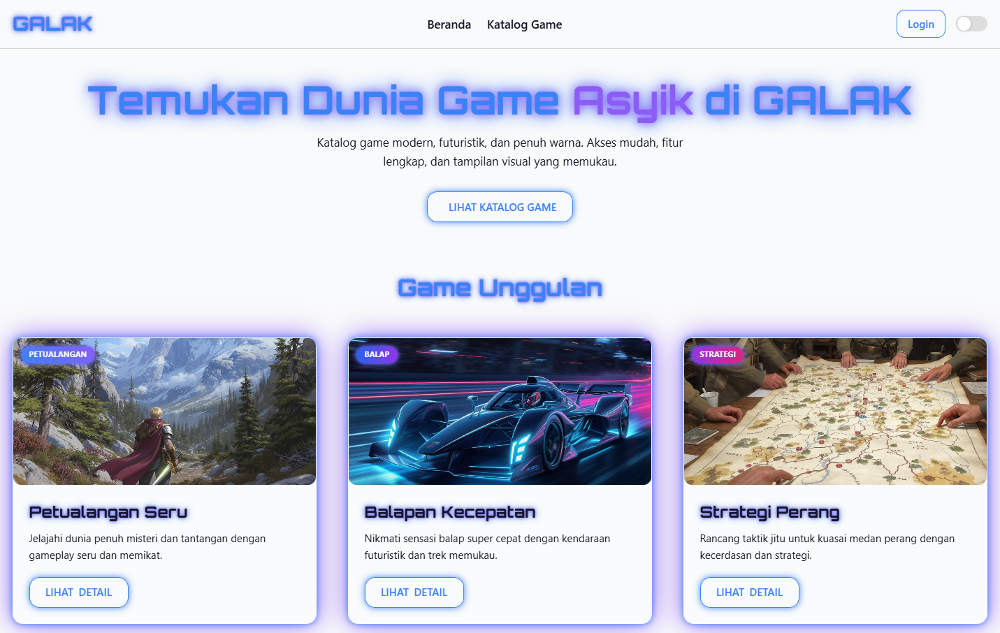
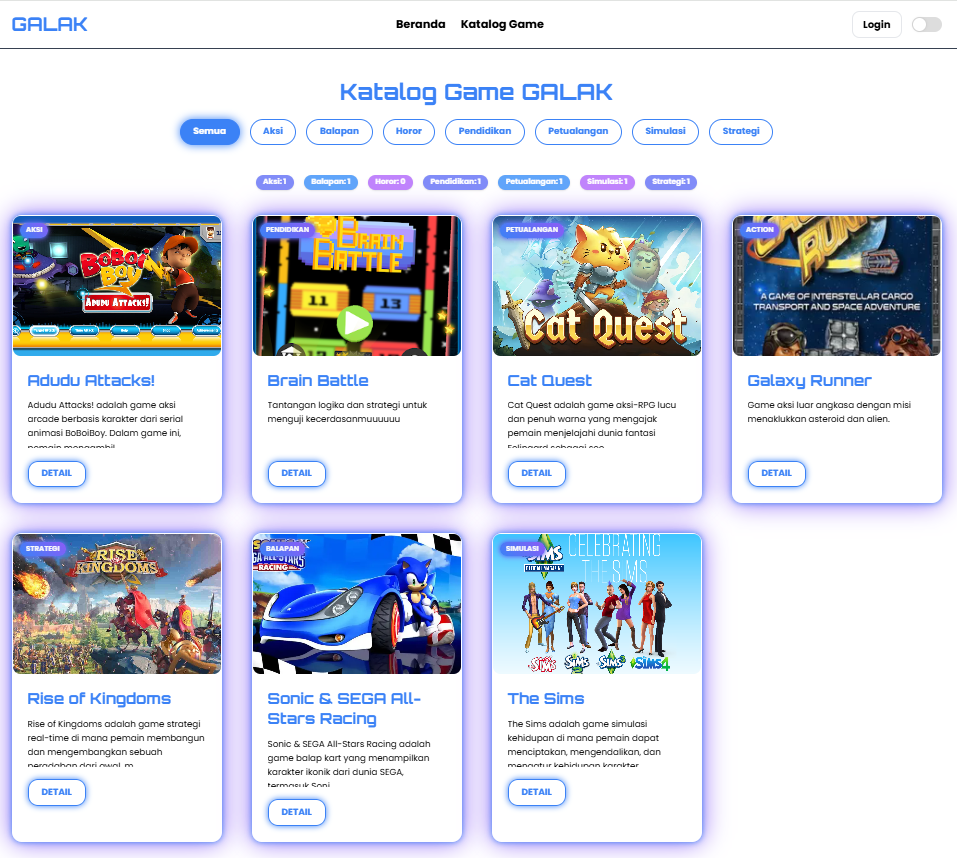
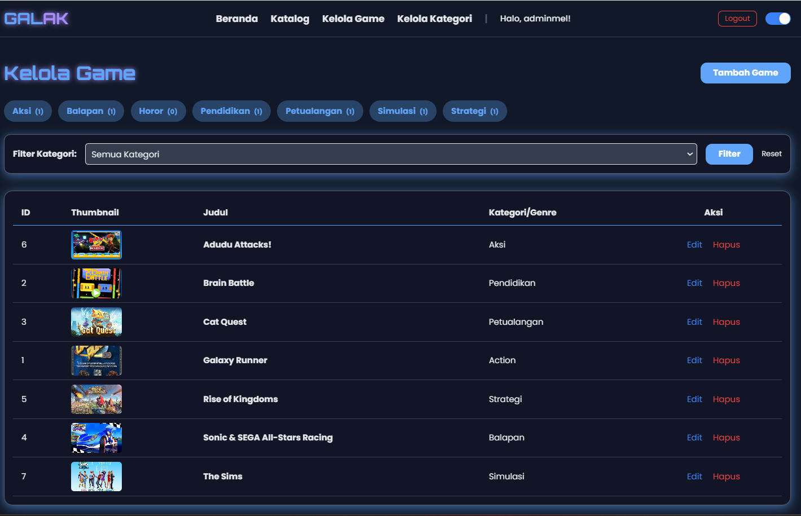
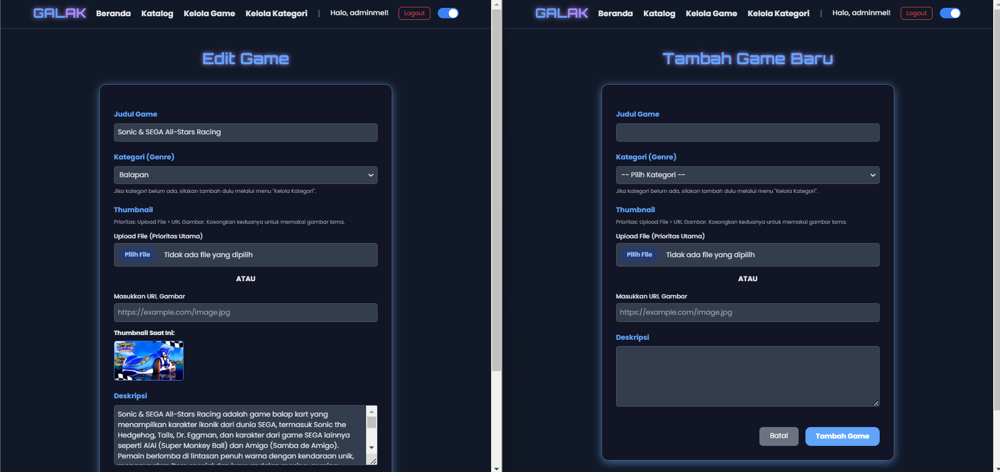
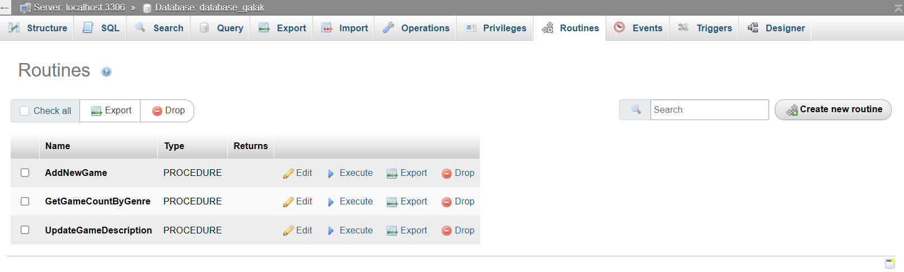
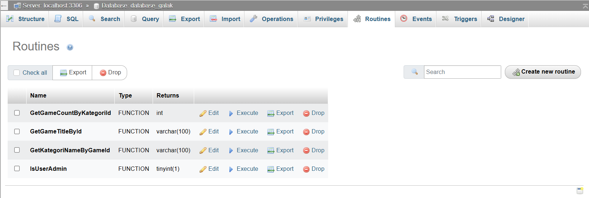
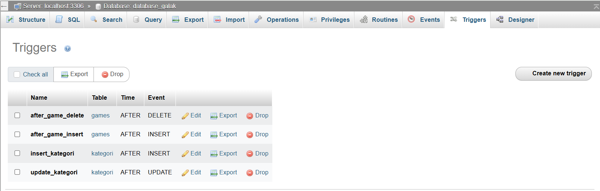
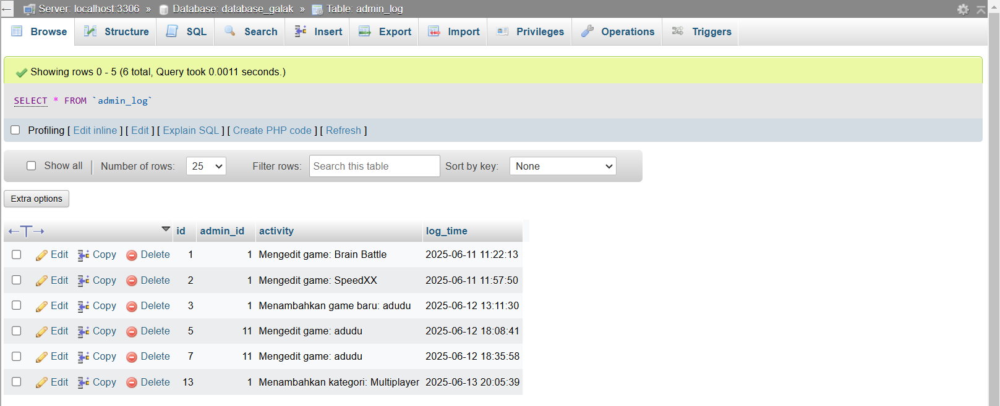

# 🎮🕹️👾 GALAK (Game Asyik Login Akses Katalog)




Proyek ini adalah sistem berbasis web yang dibangun menggunakan PHP Native dan MySQL. Tujuan dari sistem ini adalah untuk menyediakan katalog game yang bisa diakses setelah gamers melakukan login. Sistem ini dilengkapi fitur seperti: manajemen data game, pencatatan log otomatis, validasi data sebelum masuk ke database, dan cadangan (backup) data secara otomatis.

Sistem GALAK memanfaatkan fitur-fitur penting dalam database seperti **procedure**, **trigger**, **Transaction**, **function**, dan **backup terjadwal**, yang semuanya bekerja untuk menjaga keandalan dan konsistensi data.

---

## 📌 Konsep Umum

Sistem GALAK dibangun dengan pendekatan **Model-View-Controller (MVC)**, yang memisahkan bagian tampilan (view), logika pemrosesan (controller), dan akses ke database (model). Semua proses penting seperti menambah game, memperbarui deskripsi, menghitung jumlah game berdasarkan kategori dilakukan langsung melalui procedure di dalam database. Ini menjaga agar semua aturan berjalan dengan aman dan seragam, dari mana data dimasukkan (misalnya dari admin atau gamers).

---

## 📌 Konsep Utama

Model: Berisi logika untuk mengakses dan mengelola data dari database.

View: Tampilan web yang dilihat oleh pengguna.

Controller: Penghubung antara view dan model.

---

## 📄 Stored Procedure

**Stored Procedure** adalah semacam perintah yang disimpan langsung di dalam database dan digunakan berulang-ulang untuk tugas tertentu. Di sistem GALAK, prosedur ini digunakan agar semua proses berjalan dengan urutan dan aturan yang jelas. Beberapa contoh prosedur yang digunakan:

### 🎮 `AddNewGame`

Menambahkan data game baru.
Digunakan di: `admin_game_form.php`

```sql
$sql = "CALL AddNewGame(?, ?, ?, ?)";
$stmt = $conn->prepare($sql);
$stmt->bind_param('ssss', $title, $genre, $thumbnail_to_save, $description);
$stmt->execute();
```

### 🎮 `GetGameCountByGenre`

Menghitung jumlah game per genre.
Digunakan di: `hitung_game.php`, `katalog.php`

```sql
$sql_call = "CALL GetGameCountByGenre(?, @game_count)";
$stmt = $conn->prepare($sql_call);
$stmt->bind_param("s", $genre);
$stmt->execute();
```

### 🎮 `UpdateGameDescription`

Memperbarui deskripsi game berdasarkan ID.
Digunakan di: `admin_game_form.php`

```sql
$sql = "CALL UpdateGameDescription(?, ?)";
$stmt = $conn->prepare($sql);
$stmt->bind_param('is', $posted_id, $description);
$stmt->execute();
```

---

## 🧠 Function

**Function** digunakan untuk mengambil informasi dari database, tanpa mengubah apapun. Di GALAK, fungsi ini digunakan untuk menghitung jumlah game dalam kategori tertentu.

### 🕹️ `GetGameCountByKategoriId`
Digunakan untuk menghitung jumlah game pada kategori tertentu.
Digunakan di: `hitung_game.php`, `admin_kategori_list.php`, `katalog.php`

- `hitung_game.php`
    ```php
    function get_game_count_by_kategori_id($kategori_id) {
        global $conn;
        $sql = "SELECT GetGameCountByKategoriId(?) AS jumlah";
        $stmt = $conn->prepare($sql);
        $stmt->bind_param("i", $kategori_id);
        $stmt->execute();
        $result = $stmt->get_result();
        $jumlah = 0;
        if ($result && $row = $result->fetch_assoc()) {
            $jumlah = $row['jumlah'];
        }
        $stmt->close();
        return $jumlah;
    }
    ```
- `admin_kategori_list.php`
    ```php
    include_once 'hitung_game.php';
    <td><?= get_game_count_by_kategori_id($row['id']) ?></td>
    ```
- `katalog.php`
    ```php
    include_once 'hitung_game.php';
    foreach ($kategori_list as $kategori) {
        $jumlah = get_game_count_by_kategori_id($kategori['id']);
    }
    ```

### 🕹️ `GetGameTitleById`

Dapat digunakan untuk mengambil judul game berdasarkan ID-nya secara langsung dari database, jika dibutuhkan di halaman detail atau log.

```php
$stmt = $conn->prepare("SELECT GetGameTitleById(?) AS title");
$stmt->bind_param('i', $game_id);
$stmt->execute();
$result = $stmt->get_result();
$title = $result->fetch_assoc()['title'];
```

### 🕹️ `GetKategoriNameByGameId`

Mengambil nama kategori dari game tertentu.
Digunakan di: `game_detail.php`

```sql
$stmt_kat = $conn->prepare("SELECT GetKategoriNameByGameId(?) AS kategori");
$stmt_kat->bind_param('i', $game_id);
$stmt_kat->execute();
```

### 🕹️ `IsUserAdmin`

Mengecek apakah user adalah admin.
Digunakan di: `login.php`, `admin_dashboard.php`

```sql
$role_stmt = $conn->prepare('SELECT IsUserAdmin(?) AS is_admin');
$role_stmt->bind_param('i', $user['id']);
$role_stmt->execute();
```
Manfaat:

* Tidak perlu mengulang logika perhitungan di banyak tempat.
* Memastikan hasil perhitungan **konsisten** dan akurat.
---

## 🚨 Trigger

Trigger adalah aturan yang langsung dijalankan oleh database **secara otomatis** saat ada data baru dimasukkan atau diubah. Di GALAK, trigger dipakai untuk mencatat log setiap kali ada game ditambahkan atau diperbarui.

### 👾 `after_game_delete`

(AFTER DELETE pada tabel games)
Dicatat saat game dihapus.
Digunakan di: `admin_game_list.php`

```sql
$stmt_delete = $conn->prepare("DELETE FROM games WHERE id = ?");
$stmt_delete->bind_param('i', $id_hapus);
$stmt_delete->execute();
```

### 👾 `after_game_insert`
(AFTER INSERT pada tabel games)
Dicatat saat game ditambahkan.
Digunakan di: `admin_game_form.php`
```php
$sql = "CALL AddNewGame(?, ?, ?, ?)";
$stmt = $conn->prepare($sql);
$stmt->bind_param('ssss', $title, $genre, $thumbnail_to_save, $description);
$stmt->execute();
```

### 👾 `insert_kategori`
(AFTER INSERT pada tabel kategori)
Dicatat saat kategori ditambah.
Digunakan di: `admin_kategori_form.php`
```php
$sql = "INSERT INTO kategori (name, description) VALUES (?, ?)";
$stmt = $conn->prepare($sql);
$stmt->bind_param('ss', $name, $description);
$stmt->execute();
```

### 👾 `update_kategori`
(AFTER UPDATE pada tabel kategori)
Dicatat saat kategori diubah.
Digunakan di: `admin_kategori_form.php`
```php
$sql = "UPDATE kategori SET name = ?, description = ? WHERE id = ?";
$stmt = $conn->prepare($sql);
$stmt->bind_param('ssi', $name, $description, $posted_id);
$stmt->execute();
```

**Manfaatnya:**

* Menjaga transparansi aktivitas sistem.
* Admin bisa melihat siapa yang menambah atau mengubah data dan kapan waktunya.
* Mencegah data masuk tanpa catatan.

---

## 🔁 Transaction

Transaction di sini berarti **sekumpulan perintah yang dijalankan bersama-sama**, dan semuanya harus berhasil agar perubahan data disimpan. Kalau ada satu saja yang gagal, maka seluruh proses dibatalkan.

### Tambah Game & Kategori (admin_game_form.php)
Transaction digunakan saat menambah game, terutama jika kategori baru juga harus di-insert. Semua proses (insert kategori, insert game) dijalankan dalam satu perubahan.

```php
$conn->begin_transaction();
try {
    $kategori_stmt = $conn->prepare("SELECT id FROM kategori WHERE name = ? LIMIT 1");
    $kategori_stmt->bind_param('s', $genre);
    $kategori_stmt->execute();
    $kategori_result = $kategori_stmt->get_result();
    if ($kategori_result->num_rows === 0) {
        $desc_default = 'Kategori otomatis dari form game';
        $insert_kat = $conn->prepare("INSERT INTO kategori (name, description) VALUES (?, ?)");
        $insert_kat->bind_param('ss', $genre, $desc_default);
        $insert_kat->execute();
    }
    $sql = "CALL AddNewGame(?, ?, ?, ?)";
    $stmt = $conn->prepare($sql);
    $stmt->bind_param('ssss', $title, $genre, $thumbnail_to_save, $description);
    $stmt->execute();
    $conn->commit();
} catch (Exception $e) {
    $conn->rollback();
    $error_message = "Transaction gagal: " . $e->getMessage();
}
```

### Tambah/Edit Kategori (admin_kategori_form.php)
Transaction juga bisa digunakan saat menambah atau mengedit kategori agar perubahan benar-benar aman.

```php
$conn->begin_transaction();
try {
    if ($posted_id > 0) {
        $sql = "UPDATE kategori SET name = ?, description = ? WHERE id = ?";
        $stmt = $conn->prepare($sql);
        $stmt->bind_param('ssi', $name, $description, $posted_id);
    } else {
        $sql = "INSERT INTO kategori (name, description) VALUES (?, ?)";
        $stmt = $conn->prepare($sql);
        $stmt->bind_param('ss', $name, $description);
    }
    $stmt->execute();
    $conn->commit();
} catch (Exception $e) {
    $conn->rollback();
    $error_message = "Gagal mengedit game: " . $e->getMessage();
}
```

### Transaction memastikan bahwa seluruh proses berhasil sebelum data disimpan.

Manfaat Transaction:

* **Data tetap utuh** dan tidak setengah jadi.
* **Tidak ada data aneh** misalnya game sudah masuk tapi log-nya tidak ada.
* **Lebih aman**, terutama jika lebih dari satu orang sedang menggunakan sistem secara bersamaan.

---

## 🔄 Backup Database + Task Scheduler

Sistem GALAK memiliki mekanisme backup otomatis menggunakan **`mysqldump`** yang dijalankan melalui file `backup.php`. File backup akan disimpan dengan nama file berdasarkan waktu saat backup dilakukan.

### Contoh File Backup:

`backup_galak_2025-06-14_09-30-00.sql`

```bat
    @echo off
    set DATE=%date:~10,4%-%date:~4,2%-%date:~7,2%_%time:~0,2%%time:~3,2%%time:~6,2%
    mysqldump -u root database_galak > D:\AppData\Laragon\www\GALAK\storage\backups\backup_galak_%DATE%.sql
```

Backup ini **dijalankan otomatis melalui penjadwalan di Task Scheduler** Windows, agar setiap hari data tersimpan aman meskipun terjadi masalah seperti listrik mati atau sistem rusak.

---

## 🌐 Relevansi dengan Pemrosesan Data Terdistribusi

Sistem GALAK menunjukkan penerapan prinsip-prinsip **pemrosesan data terdistribusi**, yaitu:

### 1. Konsistensi

* Semua proses penting dilakukan melalui procedure dan function, agar hasilnya tetap seragam.

### 2. Keandalan (Reliabilitas)

* Trigger dan Transaction mencegah data tidak valid masuk ke sistem.

### 3. Ketahanan (Durabilitas)

* Dengan backup otomatis, data tidak mudah hilang.

### 4. Integritas

* Data yang dimasukkan, diubah, atau dihitung semuanya melalui aturan yang dijaga di sisi database.

---

# Kelompok 17 Kelas CD
## 2317051005	Carissa Oktavia Sanjaya					
## 2317051063	Sabrina Nurhasanah					
## 2317051103	Melissa Novianti Nugroho
## 2317051107	Oryza Surya Hapsari
